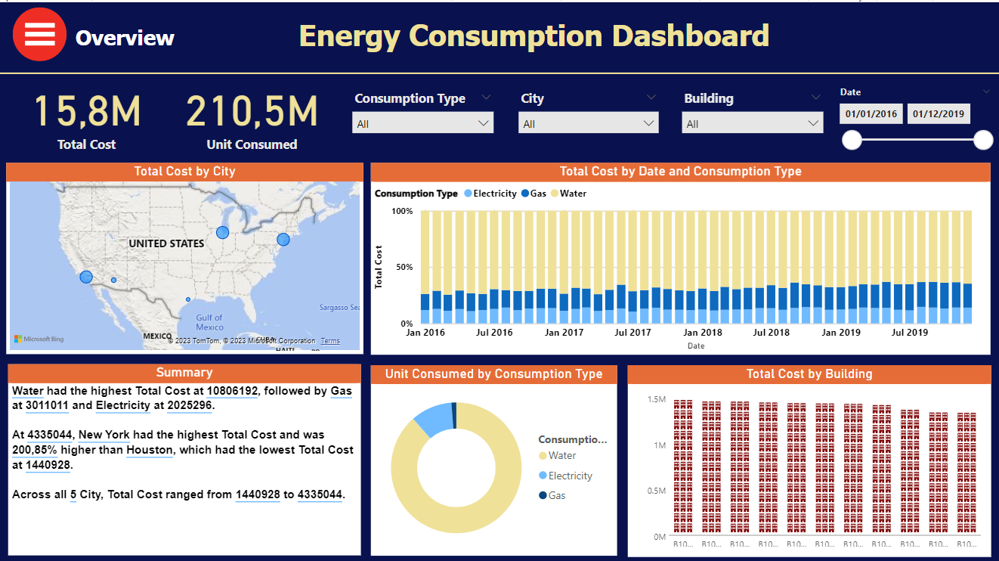
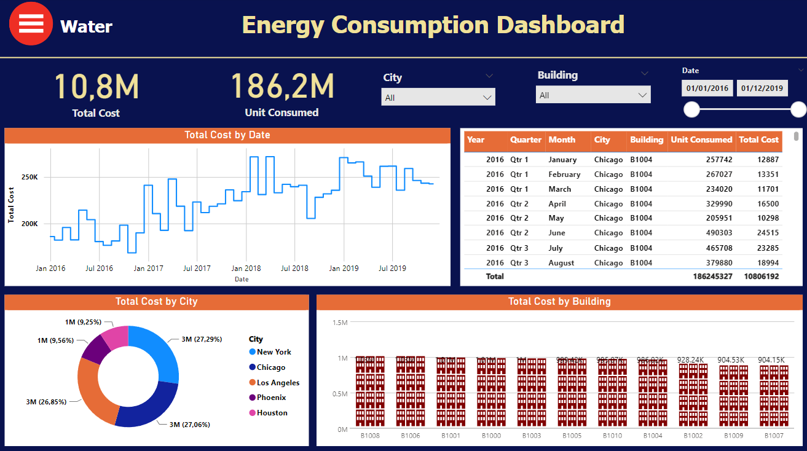
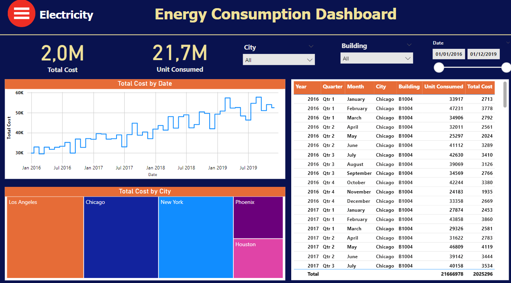
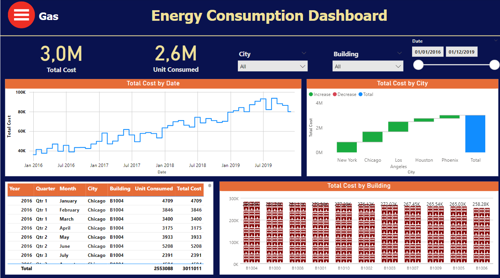

## Quality Analysis Dashboards in Power BI

Welcome to the Quality Analysis Dashboards in Power BI repository. This project encompasses a comprehensive analysis and visualization of data using Power BI, specifically focusing on quality analysis and insights.

### The dashboard can be used by a variety of stakeholders, including:

**Facility managers**,
**Energy managers**,
**Sustainability professionals**,
**Business owners and executives**

### Overview

This repository presents four distinct Power BI dashboards:

1. **Energy Consumption Overview Dashboard:** Provides a comprehensive overview of energy consumption data, including total consumption, consumption by city, type, and building, and a timeline of consumption over time.

2. **Water Energy Consumption Dashboard:** Offers a detailed analysis of water energy consumption, covering total consumption, consumption by city, building, and date, along with a breakdown of consumption by type (potable, non-potable, irrigation).

3. **Greenhouse Gas Emissions Dashboard:** Delivers insights into greenhouse gas (GHG) emissions data, encompassing total emissions, emissions by scope, source, city, and sector, and a timeline of emissions over time.

4. **Renewable Energy Generation Dashboard:** Presents a comprehensive assessment of renewable energy generation data, including total generation, generation by type, location, and time, alongside a breakdown of generation by source (solar, wind, hydro, biomass).

### Key Findings

Across the four dashboards, we have identified several key findings:

1. **Energy Consumption:** Overall energy consumption has been steadily increasing over time, with significant variations observed across cities and building types.

2. **Water Energy Consumption:** Water energy consumption patterns are closely linked to energy consumption, with significant contributions from irrigation and non-potable water use.

3. **Greenhouse Gas Emissions:** GHG emissions are primarily driven by energy consumption, with varying emission intensities across different sectors.

4. **Renewable Energy Generation:** Renewable energy generation has shown promising growth, with solar and wind being the primary contributors.

### Data Exploration

Prior to conducting data visualization, we thoroughly explored the datasets to ensure data integrity and consistency. This involved:

1. **Missing Value Analysis:** Identifying and addressing missing values to maintain data completeness and reliability.

2. **Dataset Overview:** Providing a comprehensive overview of the datasets, including data types, descriptive statistics, and potential outliers.

### Data Visualization Techniques

To effectively convey the insights extracted from the data, we employed a variety of data visualization techniques:

1. **Bar charts:** Used to visualize total energy consumption by city, type, and building.

2. **Line charts:** Used to visualize energy consumption over time.

3. **Pie charts:** Used to visualize the breakdown of energy consumption by building type.

4. **Stacked bar charts:** Used to visualize renewable energy generation by type (solar, wind, hydro, biomass) and location.

5. **Radar charts:** Used to visualize renewable energy generation by source, considering multiple dimensions such as capacity, cost, and efficiency.

6. **Treemaps:** Used to visualize the breakdown of GHG emissions by source.

7. **Scatter plots:** Used to visualize the relationship between GHG emissions and energy consumption.

### The report has 4 dashboards
**All these dashboards can be ascess from the overview button** 

1. ### Energy Consumption Dashboard:

This dashboard provides a comprehensive overview of energy consumption data, including total consumption, consumption by city, type, and building, and a timeline of consumption over time. The dashboard is designed to help users identify trends and anomalies in energy consumption, and to make informed decisions about how to reduce energy costs and improve energy efficiency.

Key Features:

1. Total energy consumption by city, type, and building
2. Timeline of energy consumption over time
3. Ability to filter and drill down into the data
4. Interactive charts and graphs

2. ### Water Energy Consumption Dashboard

This dashboard provides a comprehensive overview of water energy consumption data, including total consumption, consumption by city, building, and date, and a breakdown of consumption by type. The dashboard is designed to help users identify trends and anomalies in water consumption, and to make informed decisions about how to reduce water costs and improve water efficiency.

Key Features:

1. Total water consumption by city, building, and date
2. Breakdown of water consumption by type
3. Timeline of water consumption over time
4. Ability to filter and drill down into the data
5. Interactive charts and graphs

3. #### Greenhouse Gas Emissions Dashboard

This dashboard provides a comprehensive overview of greenhouse gas (GHG) emissions data, including total emissions, emissions by scope, source, city, and sector, and a timeline of emissions over time. The dashboard is designed to help users identify trends and anomalies in GHG emissions, and to make informed decisions about how to reduce emissions and mitigate climate change.

Key Features:

1. Total GHG emissions by scope, source, city, and sector
2. Timeline of GHG emissions over time
3. Breakdown of emissions by sector
4. Ability to filter and drill down into the data
5. Interactive charts and graphs

4. ### Renewable Energy Generation Dashboard

This dashboard provides a comprehensive overview of renewable energy generation data, including total generation, generation by type, location, and time, and a breakdown of generation by source. The dashboard is designed to help users track renewable energy generation progress, identify trends and anomalies, and make informed decisions about how to increase renewable energy capacity and reduce reliance on fossil fuels.

Key Features:

1. Total renewable energy generation by type, location, and time
2. Breakdown of renewable energy generation by source
3. Timeline of renewable energy generation over time
4. Ability to filter and drill down into the data
5. Interactive charts and graphs

### Conclusion

The Quality Analysis Dashboards in Power BI repository provides a comprehensive and insightful analysis of energy consumption, water energy consumption, greenhouse gas emissions, and renewable energy generation. The dashboards utilize effective data visualization techniques to convey the extracted insights, enabling informed decision-making for sustainable and efficient resource management.

